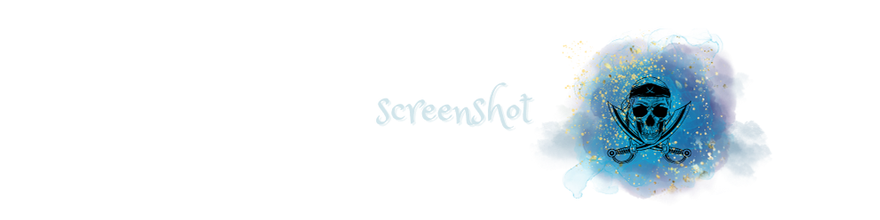
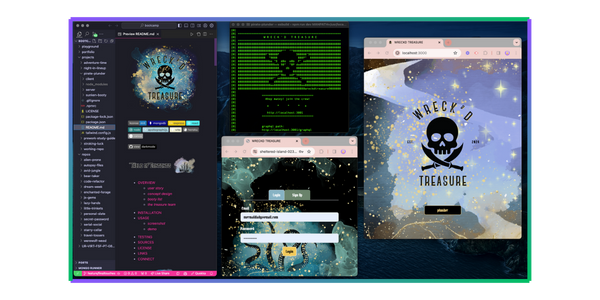
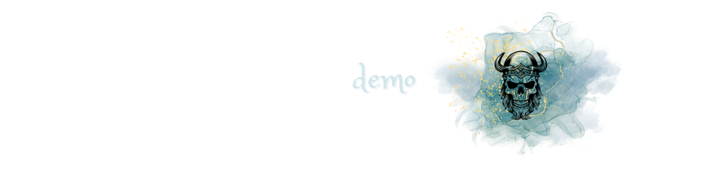

  

### 

- [OVERVIEW](#overview)
  - [*user story*](#user-story)
  - [*concept design*](#concept-design)
  - [*booty list*](#luck-list)
  - [*the treasure team*](#team)
- [INSTALLATION](#installation)
- [USAGE](#usage)
  - [*screenshot*](#screenshot)
  - [*demo*](#demo)
- [TESTING](#testing)
- [SOURCES](#sources)
- [LICENSE](#license)
- [LINKS](#links)
- [CONNECT](#connect)

### 

`WRECK'D TREASURE` is an interactive user-focuced [MERN](https://www.geeksforgeeks.org/mern-stack/) application dedicated to ***shipwrecks of the sea***. The app uses [React](https://react.dev/) for the **font end**, [GraphQl] with a [Node.js](https://nodejs.org/en) and [Express.js](https://www.npmjs.com/package/express) **server**, and [MongoDB](https://www.mongodb.com/) and the [Mongoose](https://mongoosejs.com/docs/) `ODM` for the database.

* The app meets the [PWA](https://developer.mozilla.org/en-US/docs/Web/Progressive_web_apps) criteria - runs in the browser, and will function offline.

* [vite](https://vitejs.dev/)

* [ApolloGraphQl]()

* *queries* and *mutations* for **retrieving**, **adding**, **updating**, and **deleting** data.

* [bcrypt package](https://www.npmjs.com/package/bcrypt) to **hash passwords** and [jsonwebtoken](https://www.npmjs.com/package/jsonwebtoken) to *securely transmit* information between parties as a **JSON object**

>The [.npmrc](https://docs.npmjs.com/cli/v10/configuring-npm/npmrc) file will set config values specific to this project, and ensures the app will deploy properly to [Heroku](https://www.heroku.com).

[webpack](https://webpack.js.org/) to **budle** JavaScript files for usage in the browser, and [idb](https://www.npmjs.com/package/idb) for **storing & retrieving data**.

#

### 

<!-- 
 -->
  <!-- 

 -->

### 

### 

<!-- 

  

 -->

### 

### 

##### *screenshot demonstrates `WRECK'D TREASURE's` back end, testing all routes with **ApolloGQL**, and the functional application deployed on **Heroku***

<!-- 

 -->

### 
coming soon!

#
