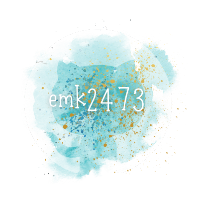
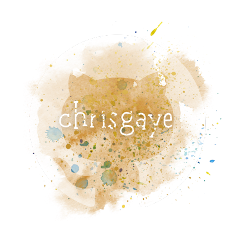

<p align="center">

</p>

[](https://opensource.org/licenses/MIT)
[](https://www.mongodb.com/)
[](https://expressjs.com/)
[](https://react.dev/)
[](https://nodejs.org/en)
[](https://www.apollographql.com/)
[](https://heroku.com)
[](https://canva.com/)
[](https://vitejs.dev/)

<p align="left">
  
</p>

### 

- [OVERVIEW](#overview)
  - [*user story*](#user-story)
  - [*concept design*](#concept-design)
  - [*booty list*](#luck-list)
  - [*the treasure team*](#team)
- [INSTALLATION](#installation)
- [USAGE](#usage)
  - [*screenshot*](#screenshot)
  - [*demo*](#demo)
- [TESTING](#testing)
- [SOURCES](#sources)
- [LICENSE](#license)
- [LINKS](#links)
- [CONNECT](#connect)


### 

`WRECK'D TREASURE` is an interactive, user-focuced [MERN](https://www.geeksforgeeks.org/mern-stack/) application dedicated to ***shipwrecks of the sea***. The app uses [React](https://react.dev/) for the **front-end**, [GraphQl](https://graphql.org/) API with a [Node.js](https://nodejs.org/en) and [Express.js](https://www.npmjs.com/package/express) **server**, and [MongoDB](https://www.mongodb.com/) / [Mongoose](https://mongoosejs.com/docs/) `ODM` for the **database**.

* [vite](https://vitejs.dev/) to **leverage** modern browser features & deliver an extremely fast development experience

* [Apollo Server]() to help implement and use the *GraphQL API*

* *[queries](https://www.apollographql.com/docs/react/data/queries)* & *[mutations](https://www.apollographql.com/docs/react/data/mutations/)* for **retrieving**, **adding**, **updating**, and **deleting** data

* meets [PWA](https://developer.mozilla.org/en-US/docs/Web/Progressive_web_apps) criteria - runs in the browser, functions offline, and is downloadable.

* [bcrypt package](https://www.npmjs.com/package/bcrypt) to **hash passwords** and [jsonwebtoken](https://www.npmjs.com/package/jsonwebtoken) to *securely transmit* information between parties as a **JSON object**


>The [.npmrc](https://docs.npmjs.com/cli/v10/configuring-npm/npmrc) file will set config values specific to this project, and ensures the app will deploy properly to [Heroku](https://www.heroku.com)

#

### 

<!-- <p align="center"> -->
  <!-- 
</p> -->

### 

### 

<!-- <p align="center">
  
</p> -->

### 

<p align="center">
  <a href="https://github.com/christiecamp"></a>
  &#8287;&#8287;&#8287;&#8287;&#8287;
  <a href="https://github.com/EMK2473"></a>
  &#8287;&#8287;&#8287;&#8287;&#8287;
  <a href="https://github.com/Sharkman478"></a>
  &#8287;&#8287;&#8287;&#8287;&#8287;
  <a href="https://github.com/ChrisGaye"></a>
</p>

#

### 

The application is invoked using the following commands:

##### *Clone the repository in your local development enviornment*

```javascript
git clone https://https://github.com/EMK2473/pirate-project.git
```

##### *Navigate to the CLI and input:*

```javascript
npm i
```
```javascript
npm run dev
```
#

### 

**INSTRUCTIONS:**

1. Open the Integrated Terminal and follow the [installation](#installation) guidelines.

2. Interact with `WRECK'D TREASURE` through your local enviorment, or open the [application]() deployed on [Heroku](https://heroku.com/home).

3. Signup by providing an email address & creating a username/password.

4. **Search for shipwrecks**.

5. *View*, *save*, & *delete* your selected shipwrecks in your **DASHBOARD**.

6. *Logout* to leave application.


##### view [demo videos](#demo) for further help


### 

##### *screenshot demonstrates `WRECK'D TREASURE's` back end, testing all routes with **ApolloGQL**, and the functional application deployed on **Heroku***

<!-- <p align="center">

</p> -->

### 

#


### 

#


### 

Here's a list of technologies used:

1. [Node.js](https://nodejs.org/en) - an open-source, cross-platform JavaScript runtime environment.

2. [Express.js](<(https://expressjs.com)>) - a minimal and flexible Node.js web application framework that provides a robust set of features for web and mobile applications.

3. [Apollo Server](https://webpack.js.org/) - an open-source, spec-compliant **GraphQL server** that's compatible with any **GraphQL client**, including [Apollo Client](). Works in conjunction with [apollo-server-express](https://www.npmjs.com/package/apollo-server-express), an *Express integration* of Apollo Server.

4. [Apollo Client](https://www.npmjs.com/package/@apollo/client) - a fully-featured caching GraphQL client with integrations for `React`, `Angular` - easily build UI components that fetch data via **GraphQL**.

4. [GraphQL](https://graphql.org/) - an open source *query language* that describes how a client should request information through an API.

5. [MongoDB](https://www.mongodb.com/) - a *NoSQL* database product that utilizes **JSON**-like documents with optional schemas.

6. [Mongoose](https://mongoosejs.com/) - a Node.j based **Object Data Modeling** *(ODM) library* for MongoDB.

7. [React](https://react.dev/) - open-source **JavaScript UI development library** for building user interfaces based on *components*. It is used with:
      * [react-bootstrap](https://www.npmjs.com/package/react-bootstrap)
      * [react-dom](https://legacy.reactjs.org/docs/react-dom.html)
      * [react-router-dom](https://www.npmjs.com/package/react-router-dom)
      * [@types/react](https://www.npmjs.com/package/@types/react)
      * [@types/react-dom](https://www.npmjs.com/package/@types/react-dom)

8. [eslint](https://eslint.org/) - a *static code analysis tool* for identifying problematic patterns found in JavaScript code. It is used with:
    * [eslint-plugin-react](https://www.npmjs.com/package/eslint-plugin-react)
    * [eslint-plugin-react-hooks](https://www.npmjs.com/package/eslint-plugin-react-hooks)
    * [eslint-plugin-react-refresh](https://www.npmjs.com/package/eslint-plugin-react-refresh)

9. [Vite](https://vitejs.dev/guide/) -  a build tool that aims to provide a faster and leaner development experience for modern web projects.

10. [brypt](https://www.npmjs.com/package/bcrypt) -  a password hashing algorithm.

11. [jsonwebtoken]() - an implementation of [JSON Web Tokens](https://datatracker.ietf.org/doc/html/rfc7519).

12. [jwt-decode](https://www.npmjs.com/package/jwt-decode) - decode, sign/resign or verify **JSON Web Tokens**.

13. [Dotenv](https://www.npmjs.com/package/dotenv) - a zero-dependency module that loads environment variables from a .env file into `process.env`.

14. [Concurrently](https://www.npmjs.com/package/concurrently) - a Node.js tool that runs multiple commands concurrently.

15. [Nodemon](https://www.npmjs.com/package/nodemon) - a Node.js tool that helps develop applications by automatically restarting the node application when file changes in the directory are detected.

16. [Heroku](https://heroku.com) - used to deploy, manage, and scale the application.


### 

##### [mit license](./LICENSE)

### 

##### [*github repo*](https://github.com/EMK2473/pirate-project)

##### [*deployed app*]()
##### [*app presentation*]()

### 

[](https://github.com/EMK2473/pirate-project)

