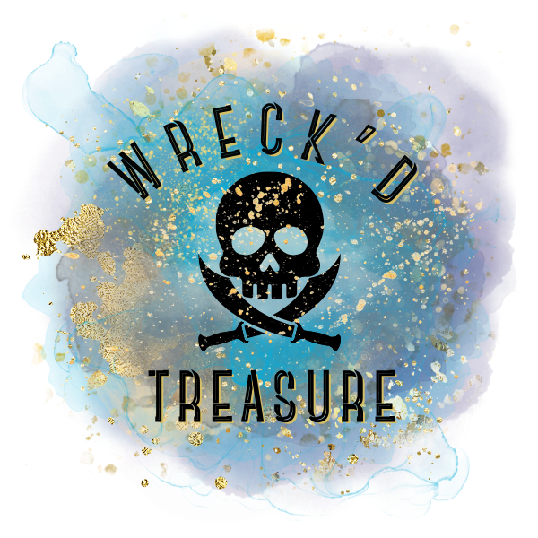
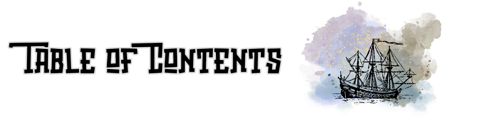
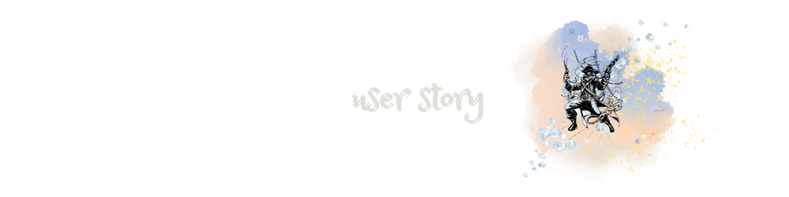
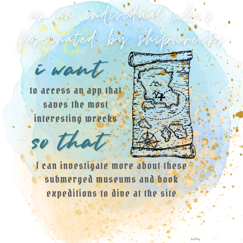
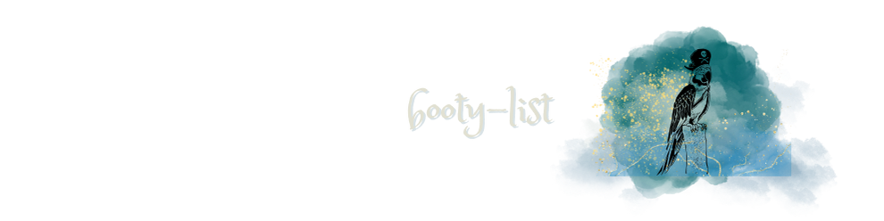
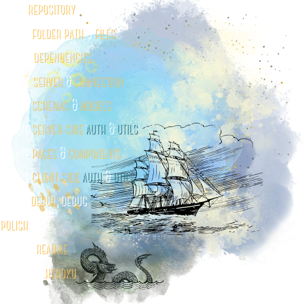
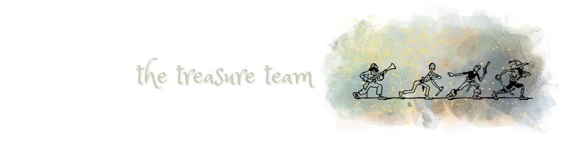

  

### 

- [OVERVIEW](#overview)
  - [*user story*](#user-story)
  - [*concept design*](#concept-design)
  - [*booty list*](#luck-list)
  - [*the treasure team*](#team)
- [INSTALLATION](#installation)
- [USAGE](#usage)
  - [*screenshot*](#screenshot)
  - [*demo*](#demo)
- [TESTING](#testing)
- [SOURCES](#sources)
- [LICENSE](#license)
- [LINKS](#links)
- [CONNECT](#connect)

### 

#

### 

<!-- 
 -->
  <!-- 

 -->

<!-- ###  -->

### 

<!-- 

  

 -->

### 
